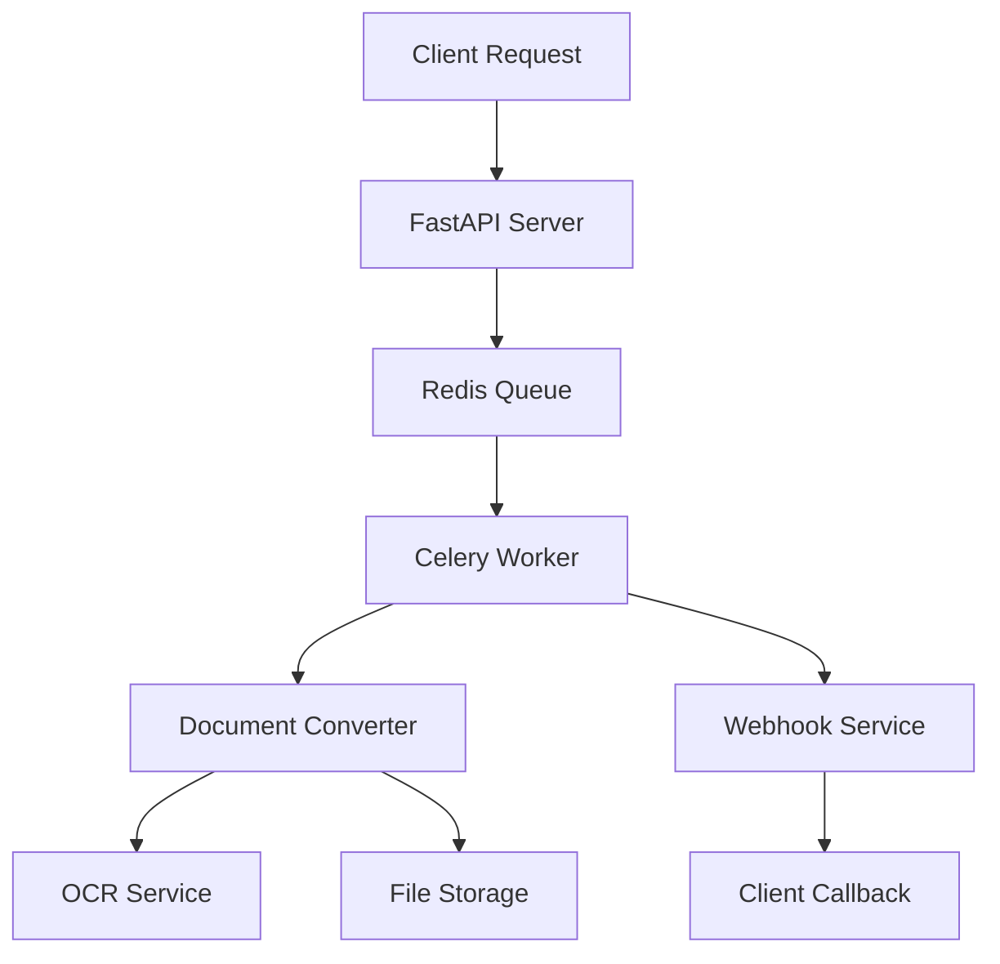

## What is Document Converter?

Document Converter is a production-ready API that transforms various document formats into structured Markdown or JSON. Built for scalability and reliability, it handles everything from PDFs and Word documents to images and spreadsheets.

<CardGroup cols={2}>
  <Card
    title="Multi-Format Support"
    icon="file-lines"
    href="/features/conversion"
  >
    Convert PDF, DOCX, PPTX, XLSX, images, and more into structured data
  </Card>
  <Card
    title="OCR Processing"
    icon="eye"
    href="/features/ocr"
  >
    Extract text from images using PaddleOCR, EasyOCR, or Mistral AI
  </Card>
  <Card
    title="Async Processing"
    icon="clock"
    href="/features/webhooks"
  >
    Queue-based processing with real-time progress tracking and webhooks
  </Card>
  <Card
    title="Production Ready"
    icon="server"
    href="/deployment/production"
  >
    Docker support, health checks, monitoring, and horizontal scaling
  </Card>
</CardGroup>

## Key Features

<AccordionGroup>
  <Accordion title="Supported Input Formats">
    - **Documents**: PDF, Microsoft Word (.docx), Rich Text Format (.rtf)
    - **Presentations**: Microsoft PowerPoint (.pptx, .pptm, .potx, .potm)
    - **Spreadsheets**: Microsoft Excel (.xlsx, .xlsm, .xls)
    - **Images**: PNG, JPEG, GIF, BMP, WebP, ICO, TIFF
    - **Text**: Plain text (.txt), Markdown (.md), Log files
    - **Other**: HTML, CSV, JSON, XML
  </Accordion>
  
  <Accordion title="Output Formats">
    - **Markdown (.md)**: Human-readable markdown with embedded base64 images
    - **Structured JSON (.json)**: Hierarchical data preserving document organization
  </Accordion>
  
  <Accordion title="OCR Providers">
    - **PaddleOCR**: High-accuracy OCR with support for 80+ languages
    - **EasyOCR**: Simple and effective OCR with good performance
    - **Mistral AI**: AI-powered OCR with advanced text understanding
  </Accordion>
</AccordionGroup>

## Architecture Overview



The Document Converter follows a modern microservices architecture:

1. **API Layer**: FastAPI server handles REST requests
2. **Queue System**: Redis-based message queue for async processing
3. **Workers**: Celery workers process conversion tasks
4. **Converters**: Modular converter system for different file types
5. **Storage**: Abstracted file storage for uploads and results
6. **Notifications**: Webhook system for real-time updates

## Quick Example

<CodeGroup>

```bash cURL
curl -X POST "http://localhost:8000/api/v1/jobs" \
  -H "Content-Type: multipart/form-data" \
  -F "file=@document.pdf" \
  -F "output_format=json" \
  -F "webhook_url=https://your-site.com/webhook"
```

```python Python
import requests

url = "http://localhost:8000/api/v1/jobs"
files = {"file": open("document.pdf", "rb")}
data = {
    "output_format": "json",
    "webhook_url": "https://your-site.com/webhook"
}

response = requests.post(url, files=files, data=data)
job = response.json()
print(f"Job ID: {job['id']}")
```

```javascript JavaScript
const formData = new FormData();
formData.append('file', fileInput.files[0]);
formData.append('output_format', 'json');
formData.append('webhook_url', 'https://your-site.com/webhook');

const response = await fetch('http://localhost:8000/api/v1/jobs', {
  method: 'POST',
  body: formData
});

const job = await response.json();
console.log('Job ID:', job.id);
```

</CodeGroup>

<Info>
  **Ready to get started?** Check out the [Quickstart Guide](/quickstart) to set up the Document Converter in minutes.
</Info>

## Use Cases

<CardGroup cols={3}>
  <Card title="Content Management" icon="folder-open">
    Convert legacy documents to searchable, structured formats
  </Card>
  <Card title="Data Extraction" icon="magnifying-glass">
    Extract structured data from invoices, reports, and forms
  </Card>
  <Card title="Document Digitization" icon="scan">
    Convert scanned documents and images to editable text
  </Card>
  <Card title="Knowledge Base" icon="book">
    Build searchable knowledge bases from document collections
  </Card>
  <Card title="Compliance" icon="shield-check">
    Archive documents in standardized formats for compliance
  </Card>
  <Card title="Automation" icon="robot">
    Integrate with workflows for automated document processing
  </Card>
</CardGroup>

## Getting Help

<CardGroup cols={2}>
  <Card
    title="Community Support"
    icon="comments"
    href="https://community.example.com"
  >
    Join our community for questions and discussions
  </Card>
  <Card
    title="GitHub Issues"
    icon="github"
    href="https://github.com/example/doc-converter/issues"
  >
    Report bugs and request features
  </Card>
</CardGroup>